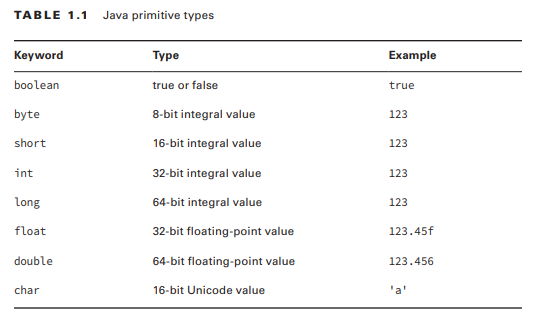
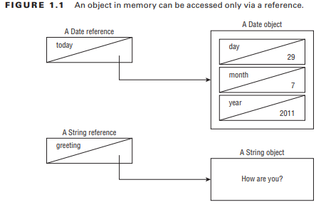

## Distinguishing Between Object References and Primitives

Java applications contain two types of data: primitive types and reference types.

### Primitive Types

Java has eight built-in data types, referred to as the Java primitive types. These eight data types represent the building blocks for Java objects, because all Java objects are just a complex collection of these primitive data types. 



* float and double are used for floating-point (decimal) values.
* A float requires the letter f following the number so Java knows it is a float.
* byte, short, int, and long are used for numbers without decimal points.
* Each numeric type uses twice as many bits as the smaller similar type. For example, short uses twice as many bits as byte does.

You should know that a byte can hold a value from –128 to 127. Since 0 needs to be included in the range, Java takes it away from the positive side.

_What Is the Largest int?_
_You do not have to know this for the exam, but the maximum number an int can hold is
2,147,483,647. How do we know this? One way is to have Java tell us:
```System.out.println(Integer.MAX_VALUE);```_

There are a few more things you should know about numeric primitives. When a number is present in the code, it is called a literal. By default, Java assumes you are defi ning an int value with a literal. 

``` long max = 3123456789; // DOES NOT COMPILE ```
``` long max = 3123456789L; // now Java knows it is a long ```

Alternatively, you could add a lowercase l to the number. **But please use the uppercase L**. The lowercase l looks like the number 1.

Java allows you to specify digits in several other formats:
* octal (digits 0–7), which uses the number 0 as a prefix—for example, 017
* hexadecimal (digits 0–9 and letters A–F), which uses the number 0 followed by x or X as a prefix—for example, 0xFF
* binary (digits 0–1), which uses the number 0 followed by b or B as a prefix—for example, 0b10

```
System.out.println(56); // 56
System.out.println(0b11); // 3
System.out.println(017); // 15
System.out.println(0x1F); // 31
```

The last thing you need to know about numeric literals is a feature added in Java 7. You can have underscores in numbers to make them easier to read:
```
int million1 = 1000000;
int million2 = 1_000_000;
```

You can add underscores anywhere except at the beginning of a literal, the end of a literal, right before a decimal point, or right after a decimal point.
```
double notAtStart = _1000.00; // DOES NOT COMPILE
double notAtEnd = 1000.00_; // DOES NOT COMPILE
double notByDecimal = 1000_.00; // DOES NOT COMPILE
double annoyingButLegal = 1_00_0.0_0; // this one compiles
```

### Reference Types

A reference type refers to an object (an instance of a class). Unlike primitive types that hold their values in the memory where the variable is allocated, references do not hold the value of the object they refer to. Instead, a reference “points” to an object by storing the memory address where the object is located, a concept referred to as a pointer. Unlike other languages, Java does not allow you to learn what the physical memory address is. You can only use the reference to refer to the object.

A value is assigned to a reference in one of two ways:
* A reference can be assigned to another object of the same type.
* A reference can be assigned to a new object using the new keyword.

**An object in memory can be accessed only via a reference**


