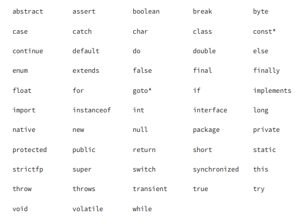

## Declaring and Initializing Variables

A variable is a name for a piece of memory that stores data.

### Declaring Multiple Variables

You can declare many variables in the same declaration as long as they are all of the same type. You can also initialize any or all of those values inline.

``` int num, String value; // DOES NOT COMPILE ```

```
boolean b1, b2;
String s1 = "1", s2;
double d1, double d2; // NOT LEGAL
int i1; int i2;
int i3; i4; // NOT LEGAL
```

In the real world, please limit yourself to one declaration per statement and line. Your teammates will thank you for the readable code.

### Identifiers

The same rules for identifi ers apply to anything you are free to name, including variables, methods, classes, and fields.

There are only three rules to remember for legal identifiers:
* The name must begin with a letter or the symbol $ or _.
* Subsequent characters may also be numbers.
* You cannot use the same name as a Java reserved word. As you might imagine, a reserved word is a keyword that Java has reserved so that you are not allowed to use it. Remember that Java is case sensitive, so you can use versions of the keywords that only differ in case. Please don’t, though.

**_const_ and _goto_ aren’t actually used in Java.**



The following examples are legal:
```
okidentifier
$OK2Identifier
_alsoOK1d3ntifi3r
__SStillOkbutKnotsonice$
```

These examples are not legal:
```
3DPointClass // identifiers cannot begin with a number
hollywood@vine // @ is not a letter, digit, $ or _
*$coffee // * is not a letter, digit, $ or _
public // public is a reserved word 
```

#### Identifiers in the real world
Most Java developers follow these conventions for identifier names:
* Method and variables names begin with a lowercase letter followed by CamelCase.
* Class names begin with an uppercase letter followed by CamelCase. Don’t start any identifiers with $. The compiler uses this symbol for some files.

Also, know that valid letters in Java are not just characters in the English alphabet. Java supports the Unicode character set, so there are more than 45,000 characters that can start a legal Java identifier. A few hundred more are non-Arabic numerals that may appear after the first character in a legal identifier. 
