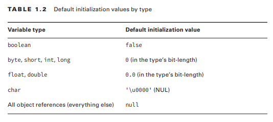

## Understanding Default Initialization of Variables

### Local Variables

A local variable is a variable defi ned within a method. Local variables must be initialized before use. They do not have a default value and contain garbage data until initialized. The compiler will not let you read an uninitialized value.

```
public void findAnswer(boolean check) {
 int answer;
 int onlyOneBranch;
 if (check) {
  onlyOneBranch = 1;
  answer = 1;
 } else {
  answer = 2;
 }
 System.out.println(answer);
 System.out.println(onlyOneBranch); // DOES NOT COMPILE
}
```

### Instance and Class Variables

Instance variables are also called fields. Class variables are shared across multiple objects. Class variable has the keyword static before it. 

Instance and class variables do not require you to initialize them. As soon as you declare these variables, they are given a default value. 


